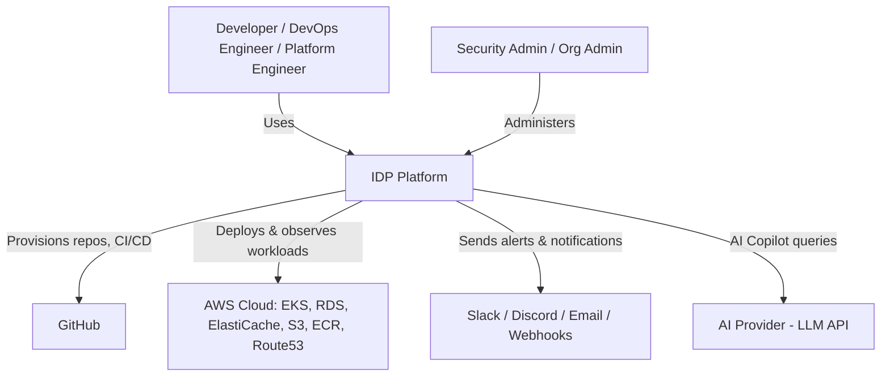
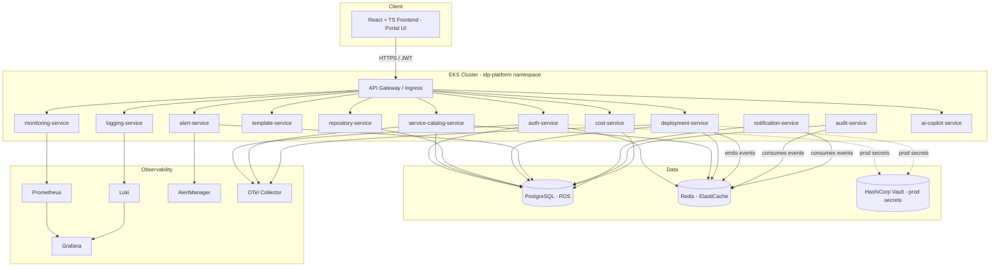
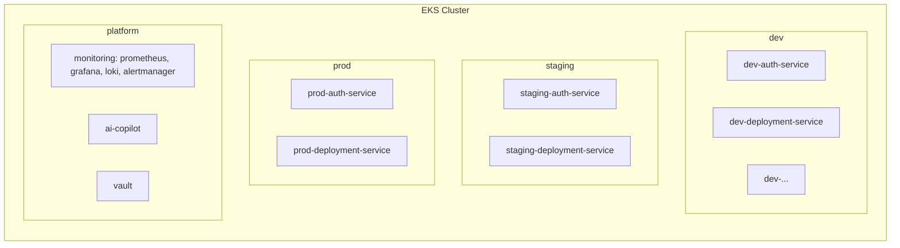
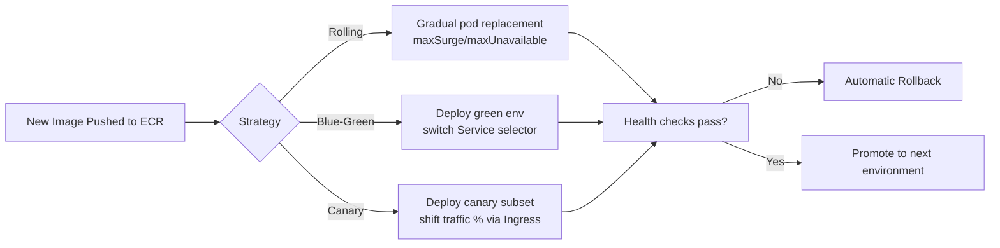
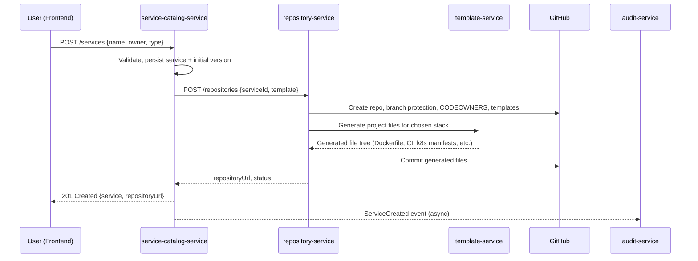

# Architecture Overview

## C1: System Context

## C2: Container Diagram

## Namespace Strategy

Each service-environment pair gets its own namespace (`<env>-<service-name>`), each with
its own ResourceQuota, NetworkPolicy, and RBAC bindings. The `platform` namespace group
hosts shared platform services (observability stack, AI Copilot, Vault) which serve all
environments.

## Deployment Strategies (per `deployment-service`)

## Request Flow Example: Create Service → Provision Repository → Generate Project

## Document Index
- `roadmap.md` — phase-by-phase delivery plan with checkpoints
- `database-schema.md` — full ER design (added in Phase 1)
- `security-architecture.md` — added in Phase 10
- `ai-copilot-architecture.md` — added in Phase 11
